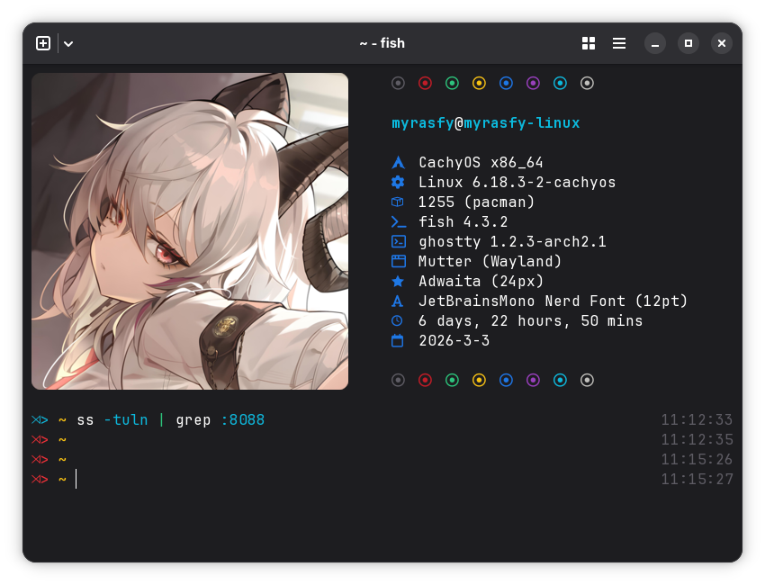
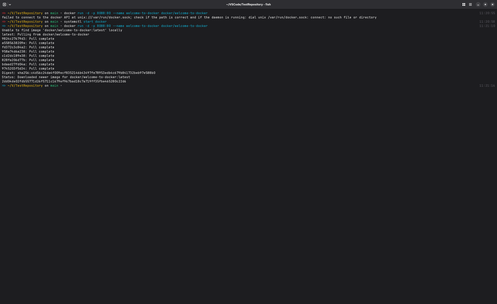
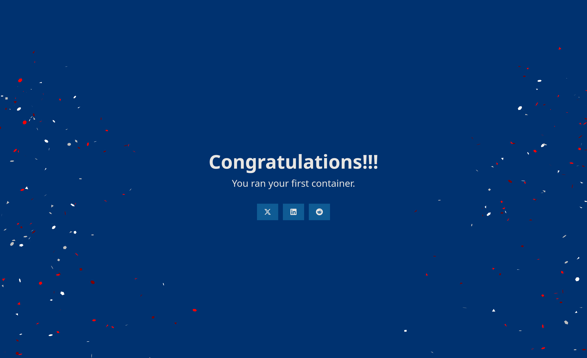
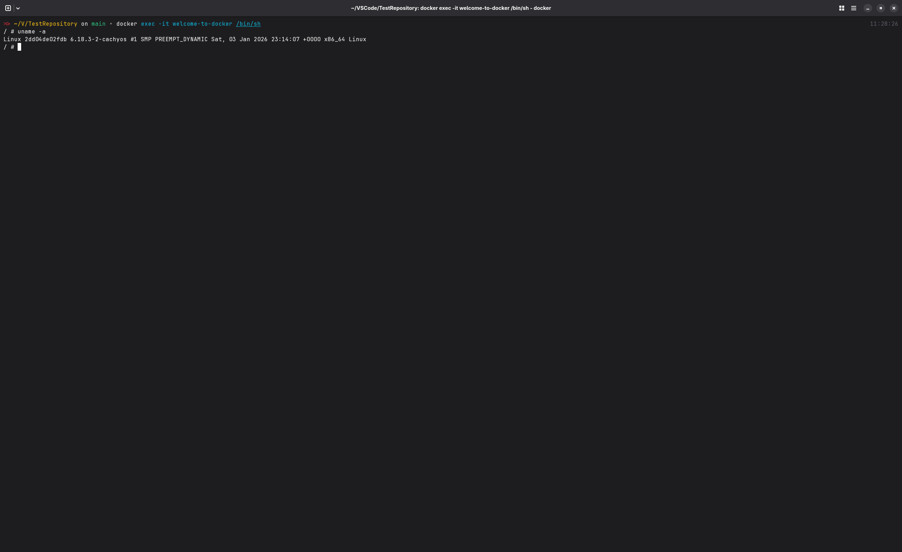
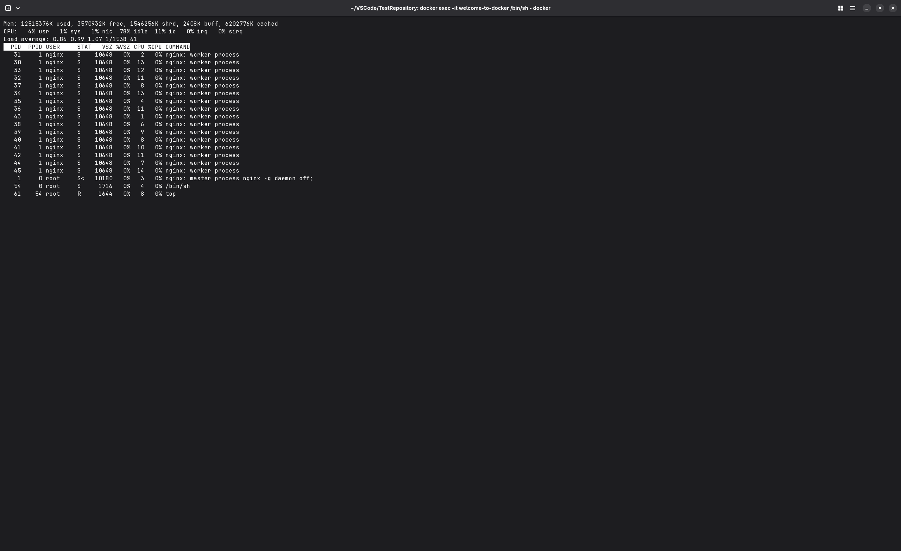
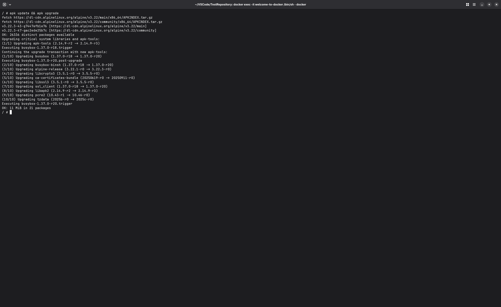
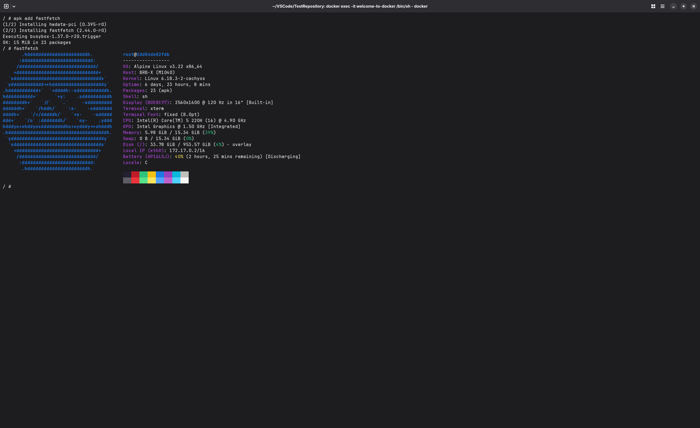

# Welcome to Docker

## Проверка порта `8080`

## Загрузка образа и запуск контейнера

## Информация по ОС

## Диспечер ресурсов

## Обновление источников приложений

gi
## Fastfetch

## Другое

